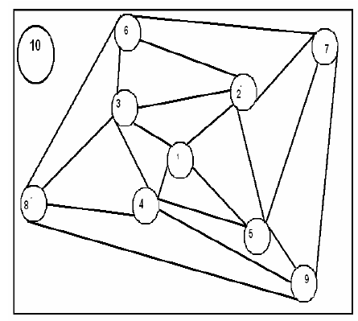
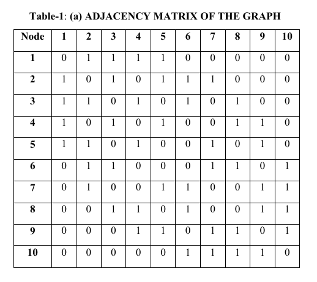
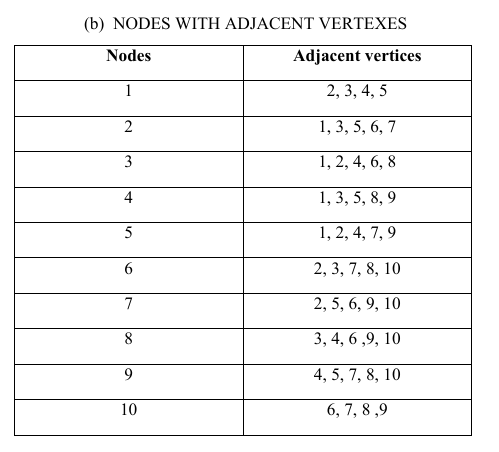
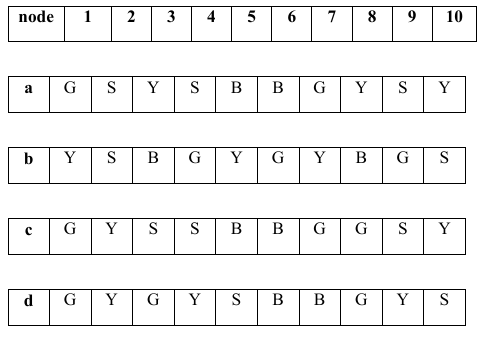
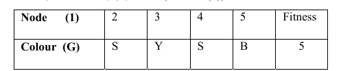
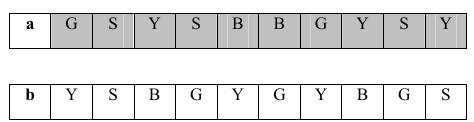
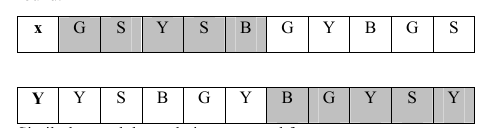
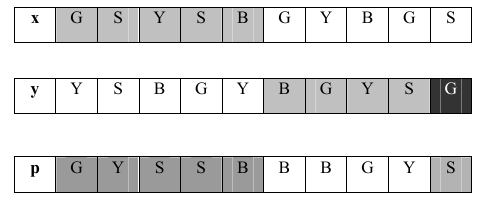
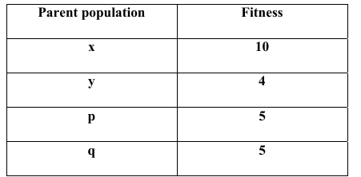

# Chromatic Numbers,Genetic Algorithm

- Genetik Algoritma yaklaşımının ortaya çıkışı 1970’lerin başında olmuştur. 1975’te John Holland’ın makine öğrenmesi üzerine yaptığı çalışmalarda canlılardaki evrimden ve değişimden etkilenerek, bu genetik evrim sürecini bilgisayar ortamına aktarması ve böylece bir tek mekanik yapının öğrenme yeteneğini geliştirmek yerine, çok sayıdaki böyle yapıların tamamını “çiftleşme, çoğalma, değişim...” gibi genetik süreçler sonunda üstün yeni bireylerin elde edilebileceğini gösteren çalışmasından çıkan sonuçların yayınlanmasından sonra geliştirdiği yöntemin adı “Genetik Algoritmalar” olarak tanınmıştır.

- Bir probleme olası pek çok çözümün içerisinde en uygununu (en iyisini) bulmaya çalışan algoritmalardır. 

-  Popülasyon nesilden nesile geliştikçe kötü çözümler yok olma, iyi çözümler ise daha iyi çözümler oluşturmak için kullanılma eğilimindedirler.

## Genetik Algoritmaların Çalışma Akışı

- **Seçilim**
- **Evrim**
- **Çaprazlama**
- **Mutasyon**
- **2 kez çalışması hedefleniyor**
- **Ilk iki en iyi populasyon verilir**
- **Tek nokta çaprazlama yapılır**
- **Çaprazlama yapılan kromozomlar**
- **2 kez Mutasyon yapılır**

## Chromatic Number Problemi
> Bir çizge yapısında birbirine komşu olan düğümlerin en az renkle birbirinden kesinlikle farklı olması hedeflenerek renklendirilir min renk sayısı bizim Chromatic sayımızı verecektir.
<p align="center">
 
</p>
<p align="center">
 
</p>

- Burada 1’den 10 a kadar olan düğümlerin komşulukları verilir.

<p align="center">
 
</p>

- Burada ise komşuluklar matris yardımıyla gösterilir.

<p align="center">
 
</p>

- Burada ise node'un komşuları ile olan ilişkileri tablolanmıştır.

## Çözüm Adımları

> Problemin çözüm yaklaşımında 3 renk kullanmayı uygun bulundu artırılabilir.

_G &rarr; YEŞIL_

_Y &rarr; SARI_

_B &rarr; MAVI_

> Her kromozom 1 den 10 kadar sıralanmıştır.Tabloda küçük harfli a,b,c,d ile ifade edilen populasyonlardır uygulamamızda POP1..
diye ifade edilmektedir.

<p align="center">
 
</p>

## Uygunluk Fonksiyonu
- Bu fonksiyon ile populasyonumuzda rasgele renklendirilmiş koşulukların hangi sırada komşuluk şartını sağlamadığı kontrol edilir uygunluk fonksiyonu en uygun değerin sıralamada en yakın sıradaki değeridir.

<p align="center">
 
</p>

## Selection
- En iyi ilk iki değer alınır.

<p align="center">
 
</p>

## Crossover

<p align="center">
 
</p>

## Mutation

<p align="center">
 
</p>

- Son olarak child populasyonun fitness değeri hesaplanır.

<p align="center">
 
</p>

#### Requirements for Run;

- [Ruby](https://www.ruby-lang.org/)
- [Ruby Version Manager](https://rvm.io/)

``` shell
  $ bundle install
  $ rackup
```
then click to link (http://localhost:9292) which goes to browser. Yay its working!!

## Acknowledgements

> This project builded for learning purposes and Artificial Intelligence 101 Class of final project.

References:

- [Using a Genetic Algorithm Approach to Solve the
Chromatic Number Problem](https://pdfs.semanticscholar.org/592f/a002c366af17178a4c57404975c3d93e7ab5.pdf)
